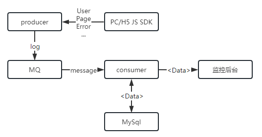
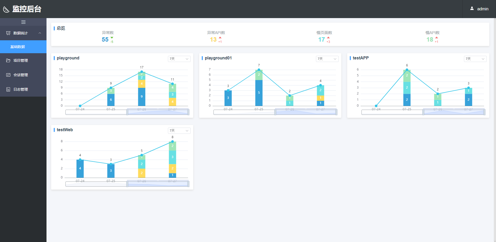
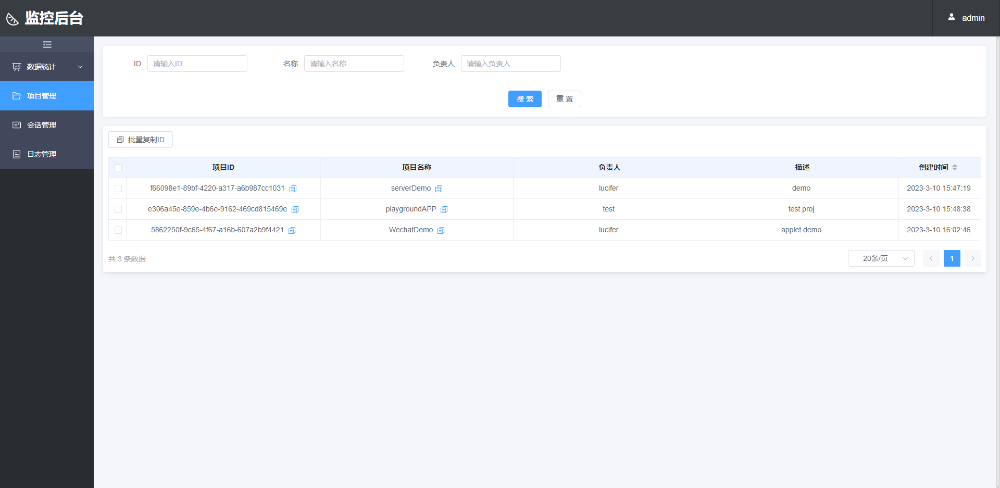
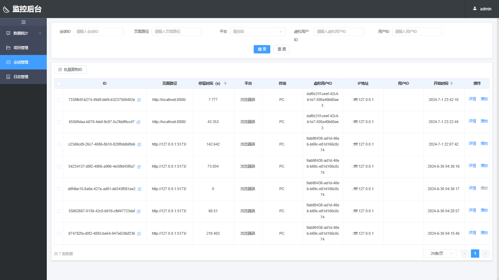
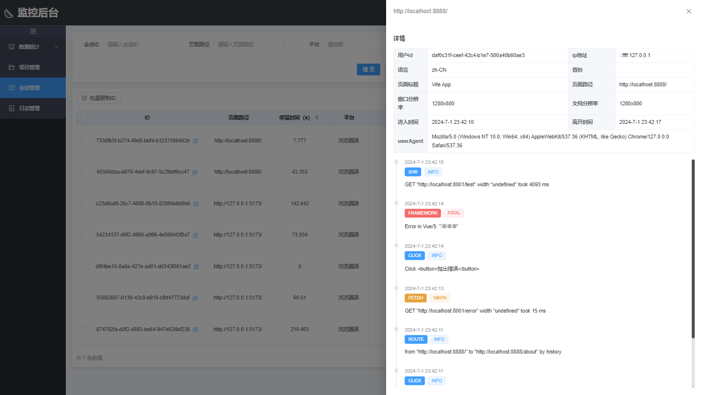
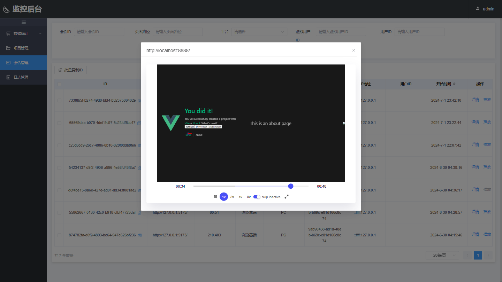
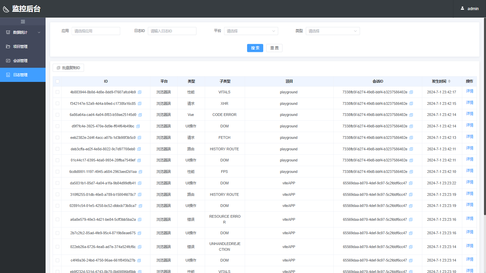
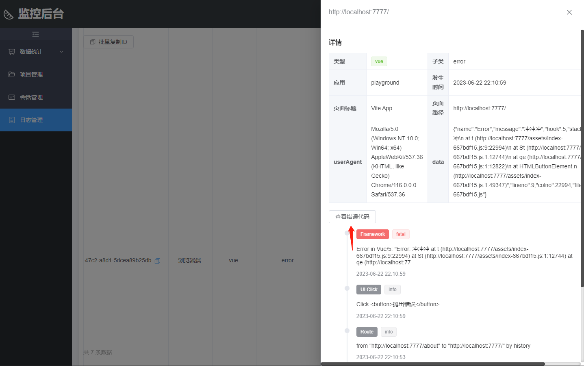
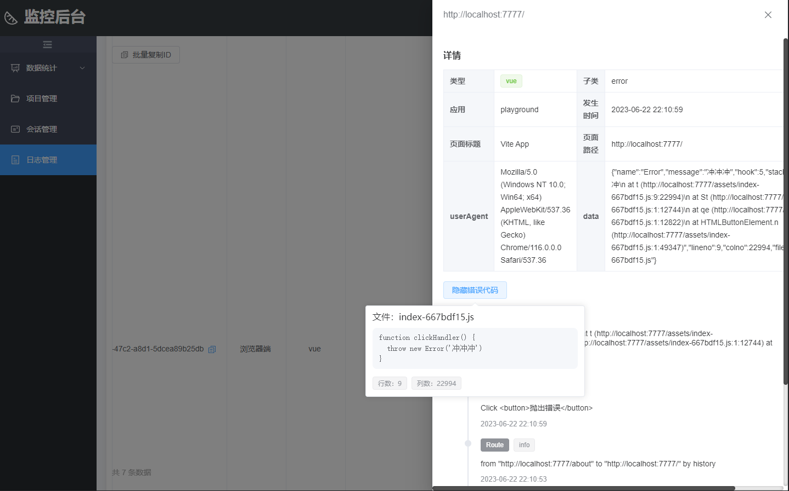

# 管理

## Server

服务端作为私有子包，不发布，可通过 [@heimdallr-sdk/cli](https://www.npmjs.com/package/@heimdallr-sdk/cli) 脚手架快速部署

服务端使用 express 作为 Node 服务端框架，ORM 库使用 Prisma，数据库则使用的是 MySQL

正如前面说的，这里我提供了两种服务端，我把它称为“单服务”与“多服务”

### “单服务”

“单服务”采用的是传统的 MVC 架构，不过这里默认的 View 不调用 API，而是作为接口文档，方便查阅；也可以修改 route 指向不同的页面

实现的主要功能如下：

- 项目的初始化（其实就是应用信息入库）
- 会话的创建与写入
- 日志信息的接收与写入（同时支持 post 与 get）
- 应用列表
- 会话列表
- 日志列表
- 接收 sourcemap 文件
- 解析 sourcemap

“单服务”既负责接收，也负责提供接口给监控后台（Manager）使用，能直接读写数据库

### “多服务”

“多服务”将服务端一分为二，分为“消费服务”与“生产服务”

使用 RabbitMQ 完成对流量的削峰填谷

#### Producer

“生产服务” 也就是图中的 producer，即生产者，面向监控 SDK，从 SDK 接收上报数据

主要功能如下：

- 接收应用信息，并推入应用队列
- 接收日志信息（会话就是两条一前一后的日志），并推入日志队列
- 接收 sourcemap 文件

#### Consumer

“消费服务” 也就是上图的 consumer，也即消费者，面向监控后台，提供读取接口给监控后台调用。

主要功能如下：

- 从应用队列中提取应用消息，写入数据库
- 从日志队列中提取日志消息，完成日志消息的“组装”，再写入数据库
- 解析 sourcemap 文件
- 提供统计数据接口
- 提供应用/项目列表接口
- 提供会话列表接口
- 提供日志列表接口

## Manager

Manager 即监控服务的管理后台，私有包，不发布，同样可以通过 [@heimdallr-sdk/cli](https://www.npmjs.com/package/@heimdallr-sdk/cli) 脚手架工具快速部署

使用了自己写的 Vue3 脚手架 [vva-cli](https://github.com/LuciferHuang/vva-cli) 快速开发的，技术栈是 Vue3 + Typescript + Element-Plus，使用 Vite 打包编译

有以下四个模块：

1. 总览

   

2. 应用列表

   

3. 会话

   

   
   详情不单开页面，在列表页右侧增加抽屉式弹层展示

   
   （回放功能需引入 `@heimdallr-sdk/record` 插件）

4. 日志

   

   

5. 查看报错代码（sourcemap）
   sourcemap 能力需配合插件使用
   

   
   